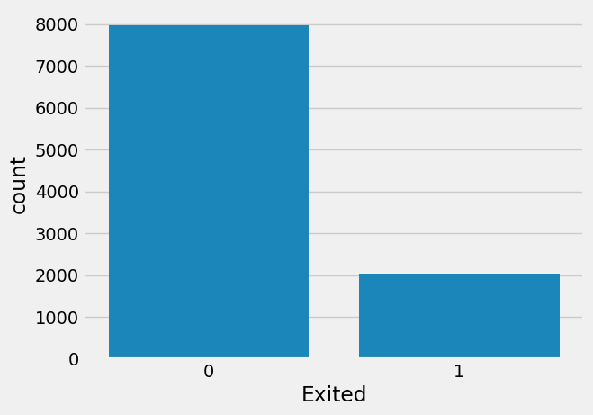

# Laporan Proyek Machine Learning
### Nama : Robi Nugraha Irianto
### Nim : 211351130
### Kelas : Pagi C

## Domain Proyek
Churn atau kehilangan pelanggan merupakan salah satu tantangan utama yang dihadapi oleh perusahaan, termasuk institusi keuangan seperti perbankan. Tingginya tingkat churn dapat berdampak signifikan terhadap pendapatan dan pertumbuhan bisnis, sehingga deteksi dini terhadap kemungkinan pelanggan akan berhenti sangat penting untuk dilakukan. Salah satu pendekatan yang efektif untuk memprediksi churn adalah dengan memanfaatkan algoritma machine learning. Logistic regression merupakan model klasifikasi dalam machine learning yang banyak digunakan dalam analisis perilaku pelanggan, termasuk dalam churn modeling untuk memprediksi kemungkinan seorang pelanggan akan keluar dari layanan

## Business Understanding

### Problem Statements
Ketidakmungkinan bagi seseorang untuk memprediksi pelanggan

### Goals
Mencari solusi untuk menganalisis perilaku pelanggan dalam konteks churn modelling guna memprediksi kemungkinan pelanggan berhenti menggunakan layanan

### Solution statements
Model yang dihasilkan dari dataset tersebut menggunakan metode Logistic Regression, yang merupakan salah satu teknik klasifikasi yang umum digunakan untuk memprediksi perilaku churn berdasarkan pola historis pelanggan.

## Data Understanding
Dataset yang saya gunakan berasal dari Kaggle.<br> 

[Churn Modelling](https://www.kaggle.com/datasets/shubh0799/churn-modelling).

### Variabel-variabel pada Churn Modelling adalah sebagai berikut:
RowNumber : merepresentasikan nomor baris dari data, yang berguna untuk identifikasi urutan data dalam dataset.

CustomerId : menunjukkan ID unik untuk setiap pelanggan dalam sistem, digunakan untuk membedakan satu pelanggan dengan yang lainnya.

Surname : menunjukkan nama belakang pelanggan. Meskipun bukan fitur numerik, data ini bisa berguna untuk segmentasi atau analisis demografis.

CreditScore : merepresentasikan skor kredit pelanggan yang menunjukkan kelayakan kredit seseorang. Semakin tinggi nilainya, semakin kecil risiko gagal bayar.

Geography : menunjukkan lokasi geografis tempat tinggal pelanggan, seperti negara atau wilayah (misalnya, Prancis, Jerman, atau Spanyol).

Gender : merepresentasikan jenis kelamin pelanggan, biasanya berupa nilai kategorikal seperti Male (Laki-laki) atau Female (Perempuan).

Age : menunjukkan usia pelanggan dalam tahun. Usia dapat memengaruhi kebiasaan finansial dan risiko churn.

Tenure : menunjukkan lamanya pelanggan telah menjadi nasabah di bank, dihitung dalam jumlah tahun.

Balance : merepresentasikan total saldo yang dimiliki pelanggan dalam rekening mereka, biasanya dalam satuan mata uang lokal.

NumOfProducts : menunjukkan jumlah produk atau layanan perbankan yang digunakan oleh pelanggan (misalnya, tabungan, pinjaman, kartu kredit).

HasCrCard : merepresentasikan apakah pelanggan memiliki kartu kredit atau tidak. Nilai 1 berarti memiliki, sedangkan 0 berarti tidak.

IsActiveMember : menunjukkan apakah pelanggan tergolong aktif dalam menggunakan layanan bank. Nilai 1 berarti aktif, dan 0 berarti tidak aktif.

EstimatedSalary : menunjukkan estimasi pendapatan tahunan pelanggan, biasanya digunakan untuk menilai kemampuan finansial.

Exited : merupakan label target yang menunjukkan apakah pelanggan meninggalkan bank atau tidak. Nilai 1 berarti telah keluar (churn), dan nilai 0 berarti masih menjadi nasabah.

## Data Preparation
### Data Collection
Untuk data collection ini, saya mendapatkan dataset yang nantinya digunakan dari website kaggle dengan nama dataset Churn Modelling, jika anda tertarik dengan datasetnya, anda bisa click link diatas.

### Data Discovery And Profiling
Untuk bagian ini, kita akan menggunakan teknik EDA. <br>
Pertama kita mengimport semua library yang dibutuhkan,

```bash
from google.colab import files
files.upload()
```

```bash
!mkdir -p ~/.kaggle
!cp kaggle.json ~/.kaggle/
!chmod 600 ~/.kaggle/kaggle.json
!ls ~/.kaggle
```

```bash
!kaggle datasets download -d shubh0799/churn-modelling
```

```bash
!unzip /content/churn-modelling.zip -d churn
!ls churn
```

```bash
import pandas as pd
import numpy as np
import matplotlib.pyplot as plt
import seaborn as sns

import warnings
warnings.filterwarnings('ignore')

plt.style.use('fivethirtyeight')
%matplotlib inline
```

```bash
df = pd.read_csv("/content/churn/Churn_Modelling.csv")
df.head()
```

```bash
df.describe()
```

```bash
df.info()
```

```bash
df.isna().sum()
```
# EDA
```bash
values = df.Exited.value_counts()
labels = ['Not Exited', 'Exited']

fig, ax = plt.subplots(figsize = (4, 3), dpi = 100)
explode = (0, 0.09)

patches, texts, autotexts = ax.pie(values, labels = labels, autopct = '%1.2f%%', shadow = True,
                                   startangle = 90, explode = explode)

plt.setp(texts, color = 'grey')
plt.setp(autotexts, size = 8, color = 'white')
autotexts[1].set_color('black')
plt.show()
```


```bash
fig, ax = plt.subplots(2, 2, figsize = (16, 10))

sns.boxplot(x = 'Exited', y = 'CreditScore', data = df, ax = ax[0][0])
sns.boxplot(x = 'Exited', y = 'Age', data = df, ax = ax[0][1])
sns.boxplot(x = 'Exited', y = 'Balance', data = df, ax = ax[1][0])
sns.boxplot(x = 'Exited', y = 'EstimatedSalary', data = df, ax = ax[1][1])

plt.tight_layout()
plt.show()
```


```bash
sns.countplot(x='Exited',data=df)
```


```bash
sns.pairplot(df)
```


```bash
plt.subplots(figsize=(20,15))
sns.boxplot(x='Age', y='Tenure', data=df)
```


```bash
df.drop(columns = ['RowNumber', 'CustomerId', 'Surname'], axis = 1, inplace = True)
df.head()
```

```bash
df.Geography.value_counts()
```

```bash
df['Geography'] = df['Geography'].map({'France' : 0, 'Germany' : 1, 'Spain' : 2})
df['Gender'] = df['Gender'].map({'Male' : 0, 'Female' : 1})
```

```bash
df.head()
```

```bash
from tensorflow.keras.utils import to_categorical

X = df.drop('Exited', axis = 1)
y = to_categorical(df.Exited)
```

```bash
from sklearn.model_selection import train_test_split

X_train, X_test, y_train, y_test = train_test_split(X, y, test_size = 0.25)
```

```bash
from sklearn.preprocessing import StandardScaler

sc = StandardScaler()
X_train = sc.fit_transform(X_train)
X_test = sc.transform(X_test)
```

# Modelling
```bash
import keras
from keras.models import Sequential
from keras.layers import Dense
from keras.layers import Dropout
from keras.layers import BatchNormalization
```

```bash
# initializing ann
model = Sequential()

# adding the first input layer and the first hidden layer
model.add(Dense(10, kernel_initializer = 'normal', activation = 'relu', input_shape = (10, )))

# adding batch normalization and dropout layer
model.add(Dropout(rate = 0.1))
model.add(BatchNormalization())

# adding the third hidden layer
model.add(Dense(7, kernel_initializer = 'normal', activation = 'relu'))

# adding batch normalization and dropout layer
model.add(Dropout(rate = 0.1))
model.add(BatchNormalization())

# adding the output layer
model.add(Dense(2, kernel_initializer = 'normal', activation = 'sigmoid'))

# compiling the model
model.compile(optimizer = 'adam', loss = 'binary_crossentropy', metrics = ['accuracy'])

# fitting the model to the training set

model_history = model.fit(X_train, y_train, validation_split = 0.20, validation_data = (X_test, y_test), epochs = 100)
```

# Evaluation
```bash
acc = model.evaluate(X_test, y_test)[1]

print(f'Accuracy of model is {acc}')
```


```bash
from sklearn.model_selection import train_test_split
from sklearn.linear_model import LinearRegression
lr = LinearRegression()
lr.fit(X_train,y_train)
```

```bash
import pickle

filename = "churn.sav"
pickle.dump(lr,open(filename,'wb'))
```

## Deployment

[My Estimation App](https://churnmodelling-nz8ledjnw6sqd7jpje7uix.streamlit.app/).


